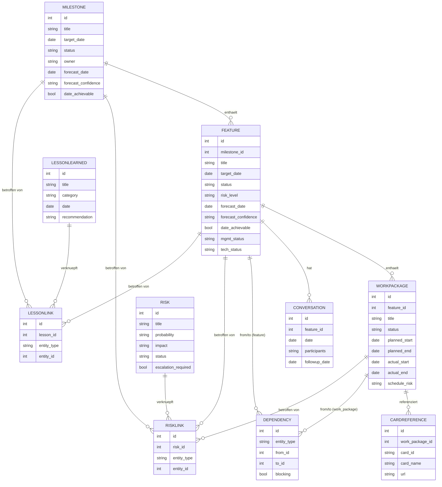

# Feature-Tracking-Modul für das Dashboard

Steuerungswerkzeug für Milestones, Features, Arbeitspakete, Risiken und Lessons Learned.
Kein Ersatz für Kanban/Jira/Kanbo — operative Arbeit bleibt dort. Dieses Modul beantwortet
ausschließlich: **"Werden wir unsere Milestones rechtzeitig erreichen, und falls nicht, warum?"**

---

## 1. Fachliche Architektur

```
┌─────────────────────────────────────────────────────────────┐
│  Frontend: air-qual-dashboard (React, CRA)                  │
│  Neues Modul: src/tracking/                                 │
│  - Eigener Navigationspunkt neben AirQuality/NetworkSpeed    │
│  - Views: Startseite, Hierarchie, Timeline, Dependency-View, │
│    Risiko-Heatmap, Forecast, Lessons-Learned-KB              │
└───────────────────────┬───────────────────────────────────────┘
                         │ REST/JSON (fetch)
┌───────────────────────▼───────────────────────────────────────┐
│  Backend: neuer Flask-Service "tracking-service"              │
│  (analog zu quickaction_persistence_service, eigener Port,    │
│   eigener nginx-Location, eigener systemd-Unit)                │
│  - REST-API für Milestone/Feature/Arbeitspaket/Risiko/...      │
│  - Berechnung abgeleiteter Werte (Terminabweichung, Markierung)│
└───────────────────────┬───────────────────────────────────────┘
                         │
┌───────────────────────▼───────────────────────────────────────┐
│  Persistenz: SQLite-Datei (z. B. tracking.db)                  │
│  Begründung siehe Abschnitt 2 — Abweichung vom bestehenden     │
│  JSON-Datei-Muster, weil die Daten relational sind             │
│  (Abhängigkeiten, Verknüpfungen Risiko↔Feature, etc.)           │
└─────────────────────────────────────────────────────────────────┘
```

Kein Schreibzugriff auf Kanban/Jira/Kanbo. Karten werden nur als **Referenz** (ID, Name, URL)
manuell gepflegt — keine Synchronisation, kein Polling, kein Webhook. Das ist bewusst so
gewählt, um keinen zweiten Datenstand der Kanban-Wahrheit zu erzeugen (siehe Abschnitt 2).

---

## 2. Kritische Bewertung des Konzepts

Das Konzept ist inhaltlich stimmig und die Trennung "Steuerung vs. operative Arbeit" ist
sauber gedacht. Es gibt aber mehrere Stellen, an denen unnötige Komplexität oder ein
"zweites Kanban" entstehen kann:

**a) Doppelte Statuspflege (Risiko: Status-Drift)**
Milestone, Feature und Arbeitspaket haben jeweils einen eigenen Ampel-Status, zusätzlich
Risiko-Level, Terminvertrauen und Forecast. Wenn das alles manuell von Hand aktuell
gehalten werden muss, verkommt es schnell zu Karteileichen — genau das Problem, das ein
zweites Kanban hätte. → Siehe Verbesserungsvorschlag (b).

**b) Arbeitspaket-Ebene ist die gefährlichste Stelle**
Arbeitspakete mit Status "Offen/In Arbeit/Blockiert/Abgeschlossen", geplanter/tatsächlicher
Start/Ende — das ist exakt der Detailgrad, den Jira/Kanban schon abdeckt. Wenn hier zu
granular und zu häufig gepflegt wird, baut sich genau das parallele System, das vermieden
werden soll.

**c) Team-Gespräche mit Standardfragen**
Sinnvoll als leichte Gesprächsnotiz, aber wenn die "Standardfragen" als Pflichtfelder
ausgestaltet werden, wird daraus schnell ein 1:1-Tool / Performance-Tracking — explizit als
Nicht-Ziel definiert. Muss bewusst freiwillig/freitextig bleiben.

**d) Lessons Learned mit Wirksamkeitsbewertung + Tagging + Volltextsuche**
Für ein Subteam-Tool mit vermutlich niedrigem Volumen (vielleicht 10–50 Einträge/Jahr) ist
eine "Wirksamkeitsbewertung" + Tag-Taxonomie + Suchindex überdimensioniert. Eine einfache
Liste mit Freitext-Tags und Browser-Suche (Filter über geladene Liste) reicht zunächst völlig.

**e) Abhängigkeitsgraph + "Visualisierung der wichtigsten Blockerketten"**
Ein performanter Graph-Renderer (z. B. für Force-Directed-Layouts) ist für die erwartete
Datenmenge (vermutlich < 100 Knoten) Overkill. Eine sortierte Liste/Baum-Darstellung
"X blockiert Y → betrifft 3 weitere Elemente" liefert 90 % des Nutzens bei 10 % des Aufwands.

**f) Automatische Forecast-Markierung**
Die Anforderung "automatisch markieren wenn erwarteter Termin später als Zieltermin" ist
gut und sollte *Berechnung*, nicht *Prognose* sein. Eine echte Vorhersage (Wahrscheinlichkeits-
modell) ist hier nicht nötig und nicht gewollt — die fachliche Einschätzung (Vertrauen,
Ursachen) bleibt menschliches Urteil, das Tool markiert nur regelbasiert.

**Fazit:** Das Konzept selbst ist richtig, aber jede Tabelle sollte beim Bau die Frage
bestehen: *"Würde das auch im Kanban stehen?"* Wenn ja → nicht im Dashboard pflegen, sondern
nur referenzieren.

---

## 3. Verbesserungsvorschläge

1. **Management-Status ist führend, technischer Status ist Kontext.** Auf Feature-Ebene wird
   in der UI primär der Management-Status gezeigt; der technische Status erscheint nur als
   Detail mit Begründungsfeld ("Grund für Abweichung"), nicht als zweite gleichwertige Ampel.
2. **Arbeitspaket-Status manuell, niedrige Update-Frequenz erwartet.** Keine Soll/Ist-Tracking-
   Automatik, keine Pflicht zur täglichen Pflege. Bewusst grob granular (wöchentlich aktualisiert
   reicht).
3. **Team-Gespräche: Standardfragen als Vorlage, nicht als Pflichtfelder.** Freitext-Feld pro
   Frage, alle optional. Keine Validierung, kein "Pflichtfeld fehlt"-Fehler.
4. **Lessons Learned v1 ohne Wirksamkeitsbewertung.** Erst nachträglich ergänzen, falls sich
   in der Praxis zeigt, dass es gebraucht wird (Prinzip: nicht für hypothetische Zukunft bauen).
5. **Abhängigkeiten v1 als Liste, nicht als Graph-Canvas.** "Blockiert"-Liste mit Ketten-Auflösung
   (rekursiv: wer ist von X betroffen) reicht für den Use Case "wie viele Elemente sind gefährdet".
   Eine echte Graph-Visualisierung kommt erst in Phase 5, wenn der Bedarf real entsteht.
6. **Verantwortliche bleiben Freitext, kein Personen-/Rechte-Modul.** Kein User-Verzeichnis, keine
   Auth-Rollen — passt zu den Nicht-Zielen (keine Leistungsbewertung, kein Mitarbeitertracking).
7. **Eigener Microservice, aber gleiches Bereitstellungsmuster wie `quickaction_persistence_service`**
   (Flask, systemd, nginx-Location), nur mit SQLite statt JSON-Dateien als Speicher — siehe Begründung
   unten.

---

## 4. Datenmodell

```
Milestone 1───* Feature 1───* WorkPackage 1───* CardReference

Feature *───* Feature           (Dependency, gerichtet, "blocks")
WorkPackage *───* WorkPackage   (Dependency, gerichtet, "blocks")

Risk *───* {Milestone | Feature | WorkPackage}   (RiskLink, polymorph)

LessonLearned *───* Milestone   (LessonLink)
LessonLearned *───* Feature     (LessonLink)

Feature 1───* Conversation
```

### Milestone
`id, title, description, target_date, status(grün|gelb|rot), owner, mgmt_comment, forecast_date, forecast_confidence(hoch|mittel|niedrig), date_achievable(bool), created_at, updated_at`

### Feature
`id, milestone_id, title, description, business_value, target_date, owner, status(grün|gelb|rot), risk_level, progress(optional, %), done_criteria, forecast_date, forecast_confidence, date_achievable(bool), forecast_updated_at, mgmt_status, mgmt_status_reason, tech_status, tech_status_reason, created_at, updated_at`

> `status` = Management-Status (führend in der UI). `tech_status` darf abweichen, inkl. Begründung.

### WorkPackage (Arbeitspaket)
`id, feature_id, title, description, owner, status(offen|in_arbeit|blockiert|abgeschlossen), planned_start, planned_end, actual_start, actual_end, schedule_risk, expected_completion_date, created_at, updated_at`

### CardReference
`id, work_package_id, card_id, card_name, url`

### Dependency
`id, entity_type(feature|work_package), from_id, to_id, blocking(bool), note`
(`from_id` hängt von `to_id` ab; `to_id` blockiert `from_id`, falls `blocking=true`)

### Risk
`id, title, description, probability(niedrig|mittel|hoch), impact(niedrig|mittel|hoch), mitigation, status(offen|beobachtet|erledigt), escalation_required(bool), escalation_date, created_at, updated_at`

### RiskLink
`id, risk_id, entity_type(milestone|feature|work_package), entity_id`

### LessonLearned
`id, title, category, date, description, recommendation, tags(csv/json), effectiveness_rating(optional, später)`

### LessonLink
`id, lesson_id, entity_type(milestone|feature), entity_id`

### Conversation (Team-Gespräch)
`id, feature_id, date, participants, blockers_text, deadline_realistic_text, risks_text, support_needed_text, assumptions_changed_text, agreed_actions, followup_date`

---

## 5. Entity-Relationship-Diagramm



---

## 6. Datenbankmodell (SQLite)

Abweichung vom bestehenden Muster (`quickaction_persistence_service` nutzt flache JSON-Dateien
pro Profil): Diese Daten sind stark relational (Abhängigkeiten, n:m-Verknüpfungen von Risiken/
Lessons zu mehreren Entitätstypen). JSON-Dateien würden Joins und referenzielle Integrität im
Anwendungscode nachbauen. **Empfehlung: SQLite-Datei**, weiterhin dateibasiert (kein DB-Server
nötig, passt zum Raspberry-Pi-Betrieb), aber mit echtem Schema.

```sql
CREATE TABLE milestone (
    id INTEGER PRIMARY KEY AUTOINCREMENT,
    title TEXT NOT NULL,
    description TEXT,
    target_date TEXT NOT NULL,
    status TEXT NOT NULL CHECK(status IN ('gruen','gelb','rot')),
    owner TEXT,
    mgmt_comment TEXT,
    forecast_date TEXT,
    forecast_confidence TEXT CHECK(forecast_confidence IN ('hoch','mittel','niedrig')),
    date_achievable INTEGER,
    created_at TEXT DEFAULT (datetime('now')),
    updated_at TEXT DEFAULT (datetime('now'))
);

CREATE TABLE feature (
    id INTEGER PRIMARY KEY AUTOINCREMENT,
    milestone_id INTEGER NOT NULL REFERENCES milestone(id) ON DELETE CASCADE,
    title TEXT NOT NULL,
    description TEXT,
    business_value TEXT,
    target_date TEXT,
    owner TEXT,
    status TEXT NOT NULL CHECK(status IN ('gruen','gelb','rot')),
    risk_level TEXT CHECK(risk_level IN ('niedrig','mittel','hoch')),
    progress INTEGER,
    done_criteria TEXT,
    forecast_date TEXT,
    forecast_confidence TEXT CHECK(forecast_confidence IN ('hoch','mittel','niedrig')),
    date_achievable INTEGER,
    forecast_updated_at TEXT,
    mgmt_status TEXT CHECK(mgmt_status IN ('gruen','gelb','rot')),
    mgmt_status_reason TEXT,
    tech_status TEXT CHECK(tech_status IN ('gruen','gelb','rot')),
    tech_status_reason TEXT,
    created_at TEXT DEFAULT (datetime('now')),
    updated_at TEXT DEFAULT (datetime('now'))
);

CREATE TABLE work_package (
    id INTEGER PRIMARY KEY AUTOINCREMENT,
    feature_id INTEGER NOT NULL REFERENCES feature(id) ON DELETE CASCADE,
    title TEXT NOT NULL,
    description TEXT,
    owner TEXT,
    status TEXT NOT NULL CHECK(status IN ('offen','in_arbeit','blockiert','abgeschlossen')),
    planned_start TEXT,
    planned_end TEXT,
    actual_start TEXT,
    actual_end TEXT,
    schedule_risk TEXT,
    expected_completion_date TEXT,
    created_at TEXT DEFAULT (datetime('now')),
    updated_at TEXT DEFAULT (datetime('now'))
);

CREATE TABLE card_reference (
    id INTEGER PRIMARY KEY AUTOINCREMENT,
    work_package_id INTEGER NOT NULL REFERENCES work_package(id) ON DELETE CASCADE,
    card_id TEXT NOT NULL,
    card_name TEXT,
    url TEXT
);

CREATE TABLE dependency (
    id INTEGER PRIMARY KEY AUTOINCREMENT,
    entity_type TEXT NOT NULL CHECK(entity_type IN ('feature','work_package')),
    from_id INTEGER NOT NULL,
    to_id INTEGER NOT NULL,
    blocking INTEGER NOT NULL DEFAULT 1,
    note TEXT
);

CREATE TABLE risk (
    id INTEGER PRIMARY KEY AUTOINCREMENT,
    title TEXT NOT NULL,
    description TEXT,
    probability TEXT CHECK(probability IN ('niedrig','mittel','hoch')),
    impact TEXT CHECK(impact IN ('niedrig','mittel','hoch')),
    mitigation TEXT,
    status TEXT NOT NULL CHECK(status IN ('offen','beobachtet','erledigt')),
    escalation_required INTEGER DEFAULT 0,
    escalation_date TEXT,
    created_at TEXT DEFAULT (datetime('now')),
    updated_at TEXT DEFAULT (datetime('now'))
);

CREATE TABLE risk_link (
    id INTEGER PRIMARY KEY AUTOINCREMENT,
    risk_id INTEGER NOT NULL REFERENCES risk(id) ON DELETE CASCADE,
    entity_type TEXT NOT NULL CHECK(entity_type IN ('milestone','feature','work_package')),
    entity_id INTEGER NOT NULL
);

CREATE TABLE lesson_learned (
    id INTEGER PRIMARY KEY AUTOINCREMENT,
    title TEXT NOT NULL,
    category TEXT,
    date TEXT,
    description TEXT,
    recommendation TEXT,
    tags TEXT,
    effectiveness_rating INTEGER
);

CREATE TABLE lesson_link (
    id INTEGER PRIMARY KEY AUTOINCREMENT,
    lesson_id INTEGER NOT NULL REFERENCES lesson_learned(id) ON DELETE CASCADE,
    entity_type TEXT NOT NULL CHECK(entity_type IN ('milestone','feature')),
    entity_id INTEGER NOT NULL
);

CREATE TABLE conversation (
    id INTEGER PRIMARY KEY AUTOINCREMENT,
    feature_id INTEGER NOT NULL REFERENCES feature(id) ON DELETE CASCADE,
    date TEXT NOT NULL,
    participants TEXT,
    blockers_text TEXT,
    deadline_realistic_text TEXT,
    risks_text TEXT,
    support_needed_text TEXT,
    assumptions_changed_text TEXT,
    agreed_actions TEXT,
    followup_date TEXT
);

CREATE INDEX idx_feature_milestone ON feature(milestone_id);
CREATE INDEX idx_workpackage_feature ON work_package(feature_id);
CREATE INDEX idx_dependency_lookup ON dependency(entity_type, from_id, to_id);
CREATE INDEX idx_risklink_entity ON risk_link(entity_type, entity_id);
CREATE INDEX idx_lessonlink_entity ON lesson_link(entity_type, entity_id);
```

---

## 7. REST-API-Design

Gleiches Muster wie `quickaction_persistence_service` (Flask, einfache Routen, JSON), neuer
Service auf z. B. Port 5002, nginx-Location `/tracking-api/`.

```
GET    /milestones                      Liste, inkl. berechneter Felder (überfällig?)
POST   /milestones
GET    /milestones/<id>
PUT    /milestones/<id>
DELETE /milestones/<id>

GET    /milestones/<id>/features
POST   /features
GET    /features/<id>
PUT    /features/<id>
DELETE /features/<id>

GET    /features/<id>/work-packages
POST   /work-packages
GET    /work-packages/<id>
PUT    /work-packages/<id>
DELETE /work-packages/<id>

GET    /work-packages/<id>/cards
POST   /work-packages/<id>/cards
DELETE /cards/<id>

GET    /dependencies?entity_type=feature&entity_id=12
POST   /dependencies
DELETE /dependencies/<id>
GET    /dependencies/blocked-by/<entity_type>/<id>     -- rekursive Kette: wer blockiert, wie viele betroffen

GET    /risks
POST   /risks
GET    /risks/<id>
PUT    /risks/<id>
DELETE /risks/<id>
POST   /risks/<id>/links          { entity_type, entity_id }
DELETE /risk-links/<id>

GET    /lessons?search=&tag=
POST   /lessons
GET    /lessons/<id>
PUT    /lessons/<id>
POST   /lessons/<id>/links
GET    /lessons/similar?title=&category=    -- Vorschläge vor Anlage eines neuen Features

GET    /features/<id>/conversations
POST   /features/<id>/conversations

GET    /dashboard/summary
  → { endangered_features, forecast_counts, open_risks, blocked_work_packages,
      upcoming_milestones, overdue_items, critical_chains, recent_lessons }
```

`GET /dashboard/summary` bündelt die Startseiten-Widgets in einem Call, damit das Frontend
nicht zehn Einzel-Requests braucht — wichtig für ein Single-Page-Dashboard auf einem Pi.

---

## 8. UI-Konzept

Neues Modul `src/tracking/`, analog zur bestehenden Struktur (`src/dashboard/`):

```
src/tracking/
  Tracking_Controller.js        -- Routing zwischen Views (wie Dashboard_Controller.js)
  api.js                        -- fetch-Wrapper für /tracking-api/
  startpage/   StartPage.js, startpage.css
  hierarchy/   HierarchyView.js  -- Milestone → Feature → Arbeitspaket, aufklappbar
  timeline/    TimelineView.js   -- Roadmap, horizontale Zeitachse
  dependencies/DependencyView.js -- Liste "blockiert / wird blockiert von", Kettenauflösung
  risks/       RiskHeatmap.js    -- Matrix Wahrscheinlichkeit×Auswirkung
  forecast/    ForecastView.js   -- Tabelle: Ziel/Erwartet/Abweichung/Vertrauen je Feature
  lessons/     LessonsView.js    -- Liste, Filter nach Tag/Kategorie, Volltextfilter
  feature/     FeatureDetail.js  -- Statuspaar, Forecast, Gespräche, verknüpfte Risiken/Lessons
```

Navigation: zusätzlicher Eintrag neben den bestehenden (AirQuality, NetworkSpeed) in der
vorhandenen Top-Level-Navigation — Startseite des Moduls ist die Management-Sicht.

Konsistent mit bestehendem Stil: einfache CSS-Dateien pro Komponente (kein UI-Framework),
Karten/Pane-Optik wie in `src/dashboard/pane/`.

---

## 9. Dashboard-Mockups

**Startseite (Management-Sicht):**

```
┌─ Terminprognose ─────────────┐ ┌─ Gefährdete Features ─────────────────┐
│ Im Plan:        7            │ │ ● Massenupdate API   J.Müller  31.07  │
│ Gefährdet:       3            │ │   Forecast: 12.08   Risiko: hoch      │
│ Niedriges Vertrauen: 2        │ │ ● Migration v2       A.Klein   15.07  │
└───────────────────────────────┘ │   Forecast: 02.08   Risiko: mittel    │
                                   └────────────────────────────────────────┘
┌─ Offene Risiken (n. Auswirkung)┐ ┌─ Blockierte Arbeitspakete ───────────┐
│ Hoch/Hoch  Externe API instabil│ │ Integration   blockiert seit 6 Tagen │
│ Mittel/Hoch Ressourcenengpass  │ │   Ursache: Backend offen              │
└─────────────────────────────────┘ │   Betrifft: 2 Features                │
                                     └────────────────────────────────────────┘
┌─ Milestones (90 Tage) ────────┐ ┌─ Überfällig ──────────────────────────┐
│ Release November  Forecast OK │ │ Feature "Reporting v1"  -4 Tage       │
│ Release Dezember  Forecast +5d│ └────────────────────────────────────────┘
└────────────────────────────────┘
┌─ Kritische Abhängigkeiten ────┐ ┌─ Letzte Lessons Learned ──────────────┐
│ Backend → blockiert 3 Elemente│ │ "API-Umstellung 2025" — Tag: migration│
└────────────────────────────────┘ └────────────────────────────────────────┘
```

**Feature-Detail:**

```
Feature: Massenupdate API                         Milestone: Release November
Management-Status: ● Gelb   Begründung: Abhängigkeit zu externem Team
Technisch:          ● Grün  (abweichend)

Ziel: 31.07   Forecast: 12.08   Vertrauen: Mittel   Termin erreichbar: Nein

Arbeitspakete                          Status        Karten
 Backend                               In Arbeit      CARD-123, CARD-124
 Integration  (blockiert von Backend)  Blockiert      CARD-125

Verknüpfte Risiken          Letzte Gespräche
 Externe API instabil        12.06 — Blocker: ja, Annahmen geändert: ja
```

---

## 10. Roadmap

| Phase | Inhalt |
|---|---|
| 0 | Konzept (dieses Dokument) — abgeschlossen |
| 1 | Backend-Grundgerüst: Flask-Service + SQLite-Schema; CRUD für Milestone, Feature, WorkPackage, CardReference; Frontend: Hierarchie-View (lesen + anlegen) |
| 2 | Dependencies + Risks: API + UI, Ketten-Auflösung ("wer ist betroffen"), Risk-Links |
| 3 | Forecast-Logik (regelbasierte Markierung) + Startseiten-Widgets (`/dashboard/summary`) |
| 4 | Lessons Learned (einfache Liste/Tags/Suche) + Team-Gespräche je Feature |
| 5 | Erweiterte Visualisierung: Timeline/Roadmap-View, Risiko-Heatmap, optionaler Abhängigkeitsgraph (nur falls Phase 2 zeigt, dass Listenansicht nicht reicht) |

Bewusst zuletzt: Graph-Visualisierung und Lessons-Wirksamkeitsbewertung — beides "nice to
have", kein Blocker für den Kernnutzen (Forecast + Risiken + Blocker sichtbar machen).
